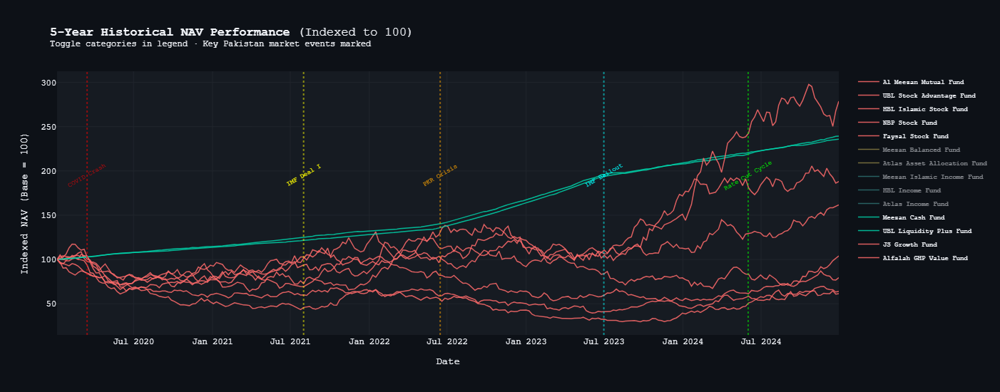
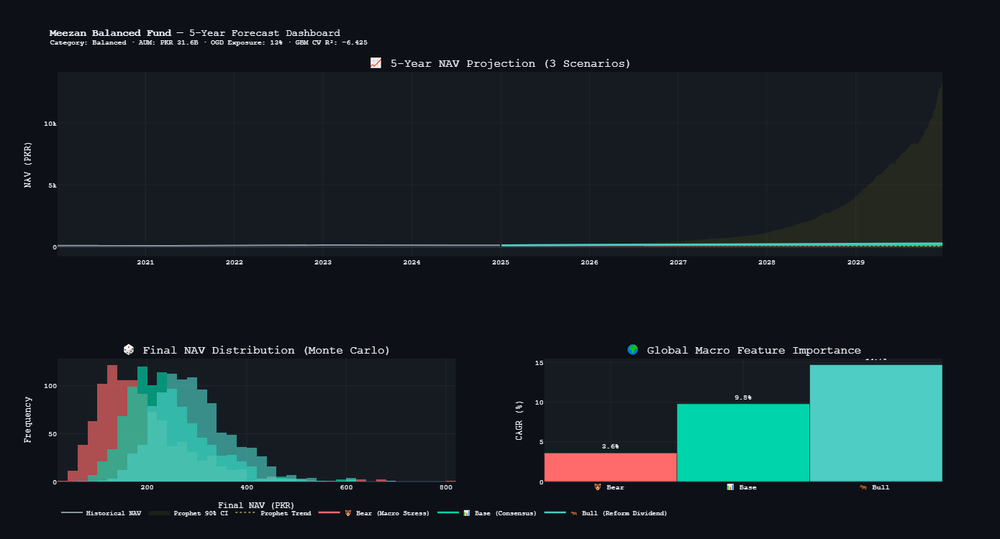
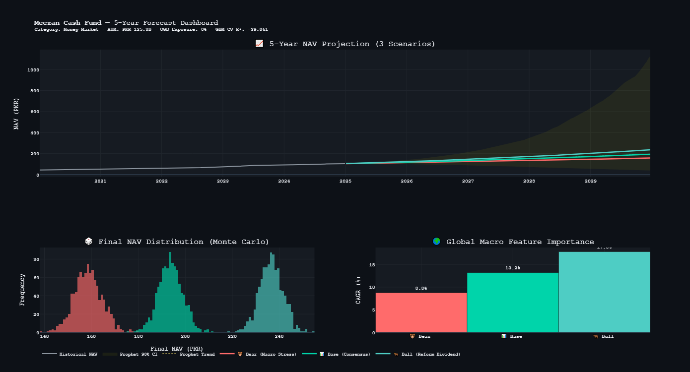
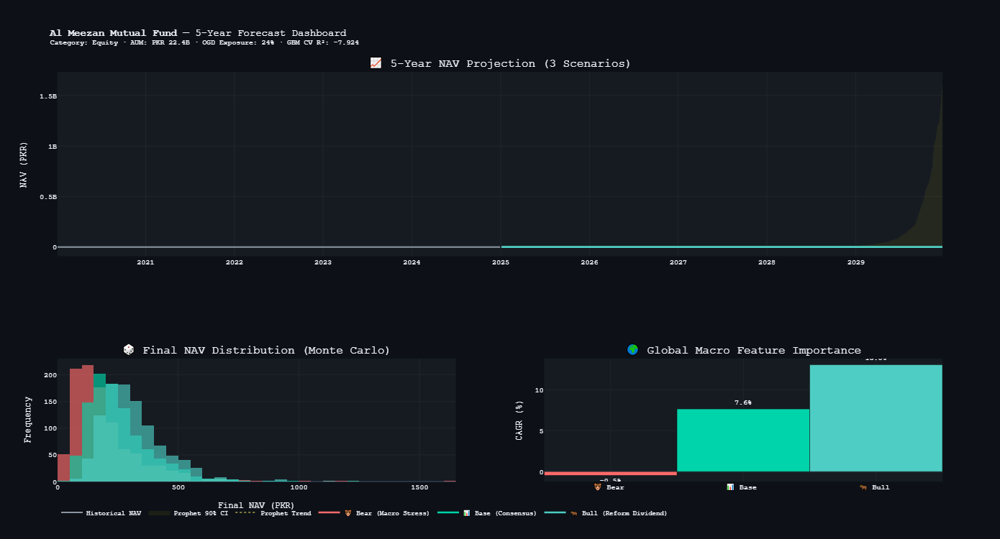
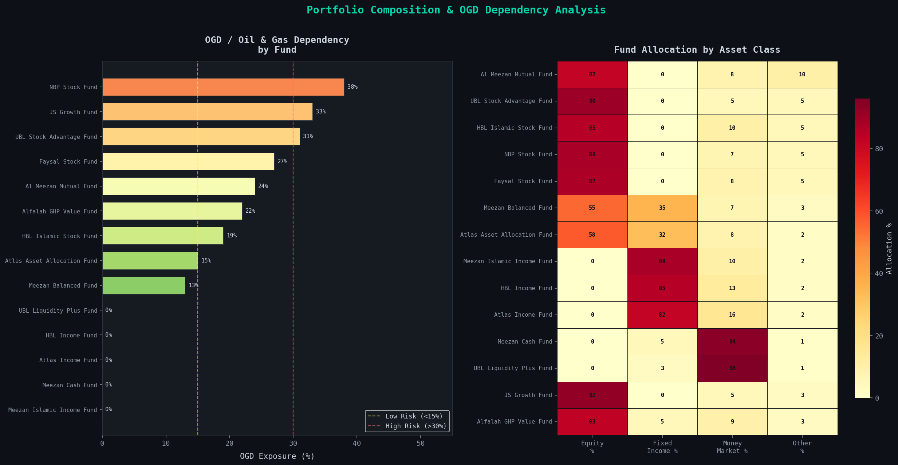
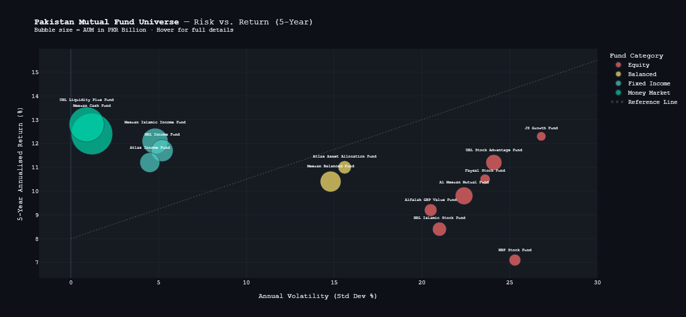
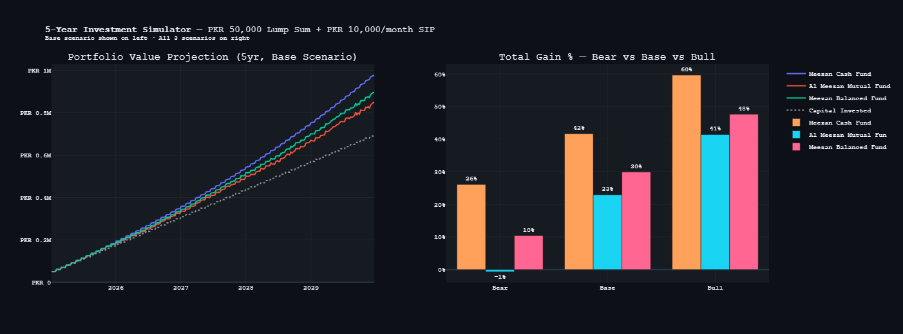

# 🇵🇰 Pakistan Mutual Fund Intelligence Platform  
### Data-Driven Mutual Fund Analytics · ML Forecasting · Risk & Sector Intelligence Dashboard

---

## 🔍 Overview

The **Pakistan Mutual Fund Intelligence Platform** is a data science system designed to analyze, compare, and forecast mutual fund performance in Pakistan using machine learning, macroeconomic indicators, and financial data processing.

It integrates NAV history, MUFAP data, PSX indicators, and global macro signals to generate actionable investment insights.

---

## 🚀 Key Features

| Feature | Description |
|--------|-------------|
| 📊 Fund Analytics | Compare equity, balanced, and income funds |
| 🤖 ML Forecasting | NAV prediction using Prophet & regression models |
| 🌍 Macro Integration | Inflation, interest rates, global indicators |
| 🧠 Risk Analysis | Volatility, Sharpe ratio, drawdown metrics |
| 🧾 Sector Exposure | Fund allocation breakdown |
| 📈 Visual Dashboard | Interactive Plotly charts |
| 🕸️ Data Pipeline | MUFAP-style data ingestion and cleaning |

---

## 🧰 Tech Stack

- Python
- Pandas / NumPy
- Scikit-learn
- Facebook Prophet
- Plotly / Matplotlib
- BeautifulSoup
- yFinance
- SciPy

---

## 📡 Data Sources

- MUFAP (Mutual Funds Association of Pakistan)
- Pakistan Stock Exchange (PSX)
- State Bank of Pakistan (SBP)
- Yahoo Finance (global indicators)

---

## 🏗️ Workflow
Data Collection → Cleaning → Feature Engineering → ML Forecasting → Visualization

---

## 📸 Demo & Visual Outputs

### 📊 NAV Performance

### 🌍 Macro Impact

### 🤖 Feature Importance

### ⚠️ Stress Testing

### 📈 Balanced Fund Projection

### 💰 Cash Fund Projection

### 📊 Mutual Fund Projection

### 🧾 Portfolio Composition

### 📉 Volatility Analysis

### 📊 Benchmark Dashboard

### 📌 Investment Plan

---

## 📊 Outputs

- Mutual fund performance comparison
- 5-year NAV forecasts
- Risk-return analysis
- Sector allocation breakdown
- Macro sensitivity insights

---

## ⚙️ Installation

git clone https://github.com/your-username/pakistan-mutual-fund-intelligence.git
cd pakistan-mutual-fund-intelligence

pip install -r requirements.txt

Manual install:
pip install prophet yfinance plotly scikit-learn requests beautifulsoup4 pandas numpy

---

## ▶️ Usage
jupyter notebook Pakistan_MutualFund_Intelligence.ipynb
Steps:

- Load dataset / scrape data
- Clean and preprocess
- Feature engineering
- Train forecasting model
- Visualize results

---
## 📌 Use Cases
- Investment analysis
- Mutual fund benchmarking
- Academic financial research
- Portfolio risk assessment
- Fintech prototyping

---
## ⚠️ Disclaimer

This project is for educational and research purposes only.
It does not constitute financial advice.

---
## 📈 Future Improvements
- Real-time NAV API integration
- LSTM / Transformer forecasting
- Portfolio optimization engine
- Streamlit dashboard
- Automated investment signals

---
⭐ If you find this useful, consider starring the repository.

---
